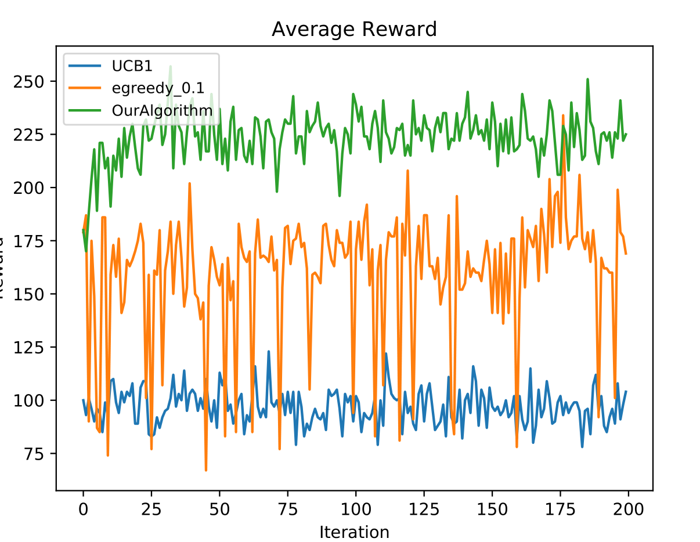
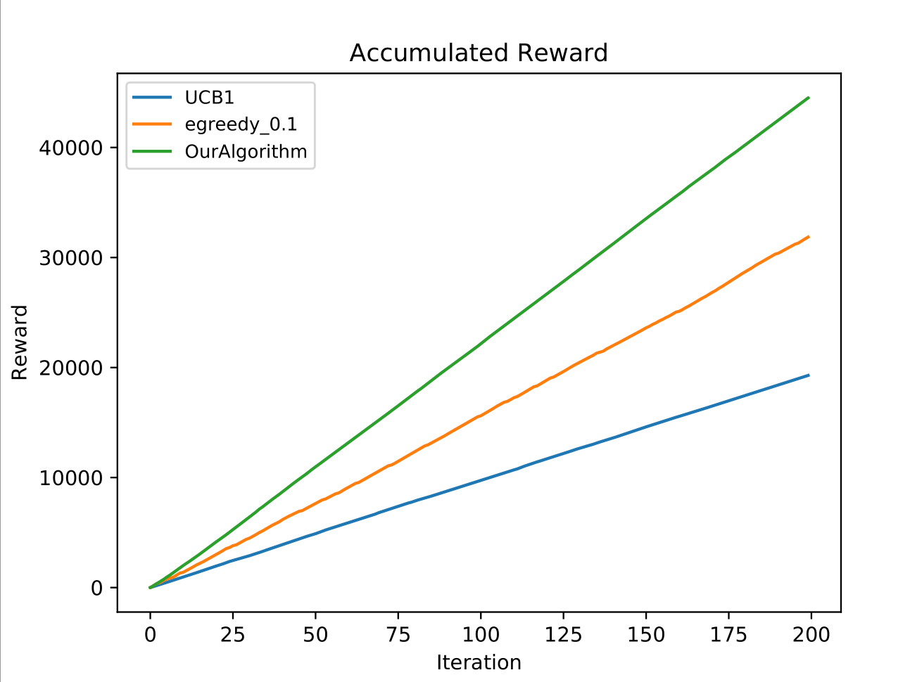

# IMBandits

IMBandit.py -- Simulator.

egreedy.py -- epsilon-greedy and UCB1 exploration strategy.

degreeDiscount.py, generalGreedy.py -- Two different oracles (IM algorithm).

IC/IC.py -- Independent cascade model, runIC() returns influence result given seed nodes.

### Result

#### Parameter

```python
graph_address = './datasets/Flickr/Small_Final_SubG.G'
prob_address = './datasets/Flickr/Probability.dic'

dataset = 'Flickr' #Choose from 'default', 'NetHEPT', 'Flickr'
batchSize = 1
alpha_1 = 0.2
alpha_2 = 0.2 
lambda_ = 0.4
gamma = 0.1
dimension = 4
seed_size = 40
iterations = 200

oracle = degreeDiscountIAC3
```

#### Experiment

```
average loss: 0.002148709235656735
average reward for oracle: 252.19
UCB1: 96.94
egreedy_0.1: 160.16
OurAlgorithm: 223.68
```
<p float="left">


</p>


