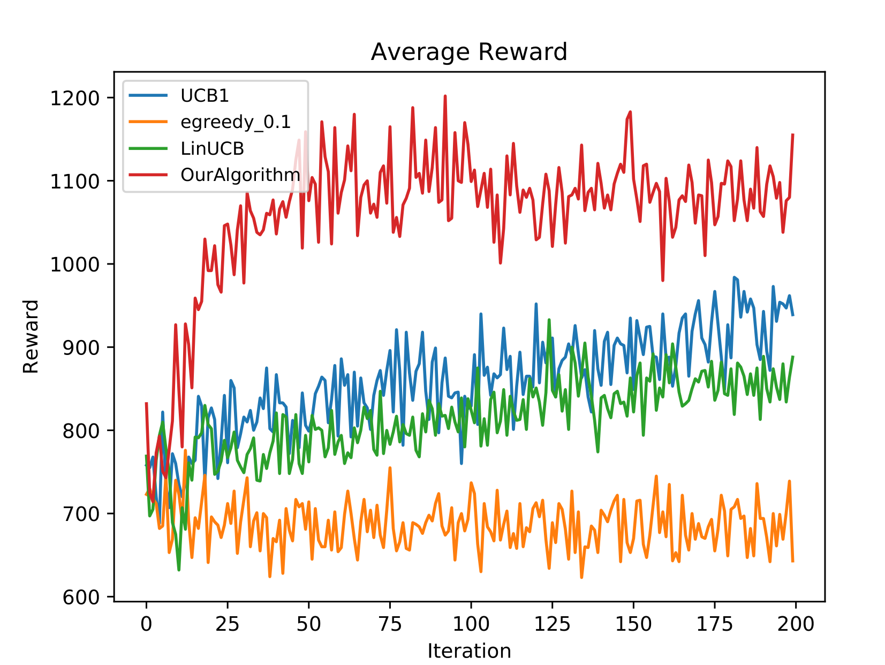
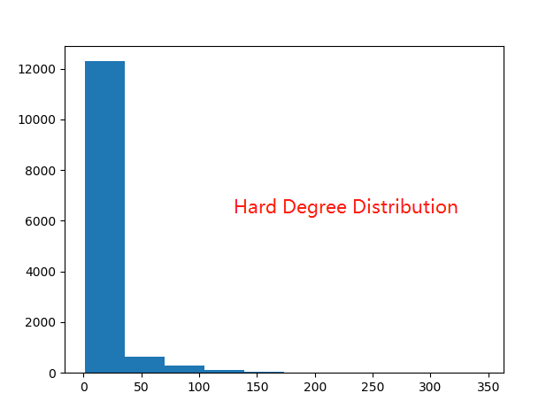
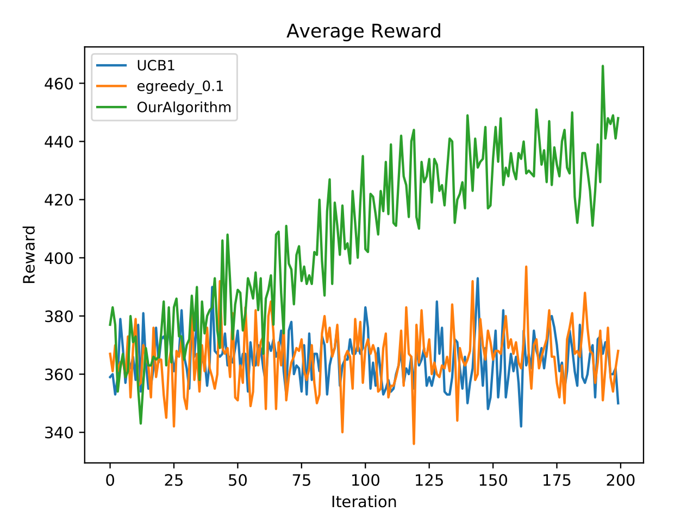
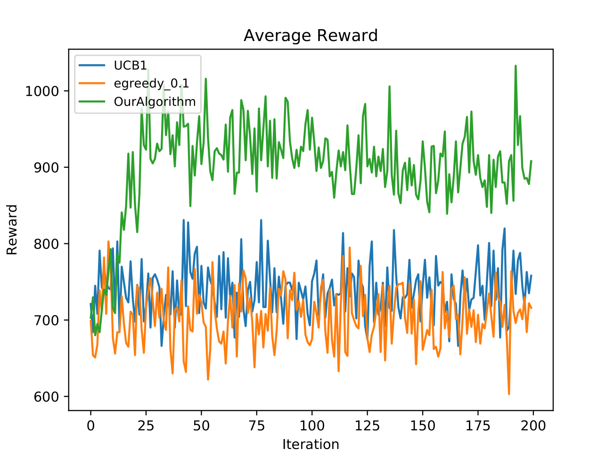

# IMBandits

IMBandit.py -- Simulator.

egreedy.py -- epsilon-greedy and UCB1 exploration strategy.

degreeDiscount.py, generalGreedy.py -- Two different oracles (IM algorithm).

IC/IC.py -- Independent cascade model, runIC() returns influence result given seed nodes.

### Result

#### Parameter

```python
graph_address = './datasets/Flickr/Small_Final_SubG.G'
prob_address = './datasets/Flickr/Probability.dic'

dataset = 'Flickr' #Choose from 'default', 'NetHEPT', 'Flickr'
batchSize = 1
alpha_1 = 0.2
alpha_2 = 0.2 
lambda_ = 0.4
gamma = 0.1
dimension = 4
seed_size = 300
iterations = 200

oracle = degreeDiscountIAC3
```

#### Experiment

```
Dimension: 4, Node number:13365, Edge Number: 132870
average reward for oracle: 1098.565
UCB1: 770.62
egreedy_0.1: 751.76
OurAlgorithm: 1033.04
```
<p float="left">





</p>

The probability does not matter so much:

scale: 1, 2, 4:

<p float="left">



</p>


Simulation dimension: 20, Algorithm dimension: 1

<p float="left">


</p>

Simulation dimension: 1, Algorithm dimension: 20

<p float="left">


</p>


